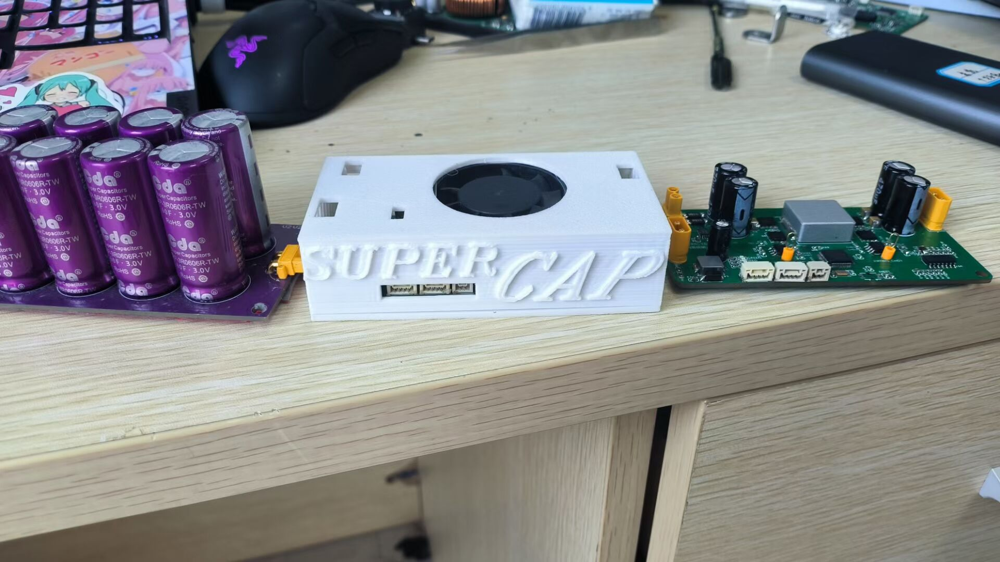

<div align="center">

[](LICENSE)
[](https://www.st.com/en/microcontrollers/stm32f334.html)
[]()
[]()

**双向拓扑超级电容管理系统** | Bidirectional Buck-Boost Super Capacitor Management System

</div>

## 项目简介

本项目是中国矿业大学（CUMT）Cubot战队为RoboMaster比赛设计的**双向拓扑超级电容管理系统**。该系统用于舵轮步兵与摩擦轮英雄机器人，旨在提高规则允许下的闲置功率利用率。

---

## 🏗️ 硬件说明

### 📦 硬件实物图



### 核心功能

- **双向DC-DC转换**: Buck-Boost拓扑，支持充电和放电模式
- **功率管理**: 多环PID控制（电压环、电流环、功率环）
- **智能模式切换**: 基于占空比的平滑模式切换
- **CAN通信**: 与RoboMaster主控板实时通信
- **故障保护**: 过压、欠压、过流、短路保护

### 技术规格

| 参数 | 规格 |
|------|------|
| 主控芯片 | STM32F334C8Tx |
| PWM频率 | HRTIM 46.08kHz |
| 输入电压 | 24V (电池) |
| 电容电压 | 26V (目标) |
| 最大充电功率 | 200W |
| 控制方式 | 数字控制 (PID) |

---

## 2. 许可证说明

本项目采用 **CERN-OHL-S v2** (CERN Open Hardware Licence - Strongly Reciprocal) 开源许可证。

### 2.1 许可证权利

- ✅ 可自由使用、复制、修改本项目
- ✅ 可用于商业产品开发
- ✅ 可分发本项目及其衍生产品

### 2.2 许可证义务

- ⚠️ 分发时必须使用相同的 CERN-OHL-S v2 许可证
- ⚠️ 如果创建基于本项目的衍生产品，必须开源源代码
- ⚠️ 不得使用CERN的名称或标识进行商业背书
- ⚠️ 本项目按"原样"提供，无任何担保

### 2.3 第三方组件

| 组件 | 许可证 | 说明 |
|------|--------|------|
| STM32 HAL库 | BSD-3-Clause | ST官方提供 |
| CMSIS | Apache 2.0 | ARM官方提供 |

---

## 3. 项目结构

```
cumt-RoboMaster-SuperCap/
├── LICENSE                    # CERN-OHL-S v2 许可证全文
├── README.md                  # 项目说明
│
├── Code Project/              # 代码项目
│   └── CAP_Code钳位/
│       ├── Core/              # CubeMX生成代码
│       │   ├── Inc/           # 头文件
│       │   └── Src/           # 源文件 (main.c, adc.c, can.c, etc.)
│       ├── MDK-ARM/           # Keil工程
│       │   └── bsp_user/      # 用户驱动层
│       │       ├── function.c/h   # 核心控制逻辑
│       │       ├── drv_can.c/h    # CAN通信驱动
│       │       ├── drv_pid.c/h    # PID控制器
│       │       ├── power_calc.c/h # 功率计算
│       │       ├── filter.c/h     # 滤波算法
│       │       └── drv_usart.c/h # 串口调试
│       ├── Drivers/           # STM32 HAL库
│       └── F334_series.ioc    # CubeMX配置文件
│
├── PCB Project/               # PCB设计文件
│   └── banzang电容_2023-06-19.epro  # 立创EDA工程
│
├── Gerber制版文件/           # PCB制造文件 (Gerber)
│
└── Screenshots/               # 产品图片
```

---

## 4. 硬件设计说明

### 4.1 拓扑结构

本项目采用**双向Buck-Boost拓扑**：

```
┌─────────┐     ┌─────────┐         ┌──────────┐
│  Battery │────▶│  Buck  │◀────▶│  Super   │
│   24V   │     │  Boost  │         │ Capacitor│
└─────────┘     │ (双向)   │        │   26V    │
                └─────────┘         └──────────┘
                      │              
                      ▼              
                ┌─────────┐     
                │ Chassis │
                │  负载   │     
                └─────────┘     
```

### 4.2 关键设计特点

1. **双向拓扑**: 使用同一套功率级实现充电和放电
2. **软启动**: 防止上电时Buck反向识别为高Boost导致炸板
3. **占空比切换**: 使用占空比判断进行模式切换，比电压判断更稳定

### 4.3 已解决问题

| 问题 | 解决方案 |
|------|---------|
| 上电炸板 | 增加前馈抑制浪涌 |
| 模态切换不稳定 | 使用占空比判断代替电压判断 |

### 4.4 已知问题

| 问题 | 说明 |
|------|------|
| 9025电机适配 | 电调内部TVS可能烧毁 |
| 屏蔽电感 | 建议更换为磁环电感以提高耐流 |

---

## 5. 软件架构

### 5.1 控制流程

```
┌─────────────────┐
│   CAN接收       │ ← 接收主控功率指令
└────────┬────────┘
         ▼
┌─────────────────┐
│  功率计算       │ ← ADC采样电压/电流
└────────┬────────┘
         ▼
┌─────────────────┐
│  功率环PID      │ ← 目标功率 vs 实际功率
└────────┬────────┘
         ▼
┌─────────────────┐
│  模式判断       │ ← Buck / Mix / Boost
│  (BBMode)       │
└────────┬────────┘
         ▼
┌─────────────────┐
│  方向判断       │ ← 充电 / 放电
│  (DRMode)       │
└────────┬────────┘
         ▼
┌─────────────────┐
│  状态机         │ ← Init / Wait / Rise / Run / Err
│  (StateM)       │
└────────┬────────┘
         ▼
┌─────────────────┐
│  HRTIM PWM输出  │ ← 控制功率MOS
└─────────────────┘
```

### 5.2 主要模块

| 模块 | 功能 |
|------|------|
| `function.c` | 核心控制逻辑、状态机、模式切换 |
| `drv_pid.c` | PID控制器实现 |
| `drv_can.c` | CAN通信（接收功率指令、发送电容状态） |
| `power_calc.c` | ADC采样、功率计算 |
| `filter.c` | 数字滤波算法 |

---

## 6. 快速开始

### 开发环境

- **IDE**: Keil MDK-ARM
- **CubeMX**: STM32CubeMX (用于配置)
- **编译器**: ARM GCC 或 ARMCC

### 编译步骤

1. 使用 Keil 打开 `F334_series.uvprojx` 工程文件
2. 选择目标芯片: STM32F334C8Tx
3. 编译项目生成 hex 文件
4. 使用 JLink 或 ST-Link 烧录到芯片

### ⚠️ 注意事项

- 代码中的ADC拟合参数需要根据实际采样芯片重新校准。不同批次的采样芯片可能存在偏差。
- 建议使用磁环电感以提高耐流能力。

---

## 7. 调试记录

1. ✅ 上电炸板问题 - 已解决 (增加前馈抑制浪涌)
2. ✅ 模态切换不稳定 - 已解决 (使用占空比钳位判断)
3. ⚠️ 9025电机适配 - 未解决 
4. ⚠️ 屏蔽电感耐流 - 建议更换为磁环电感

---

## 8. 贡献指南

欢迎提交Issue和Pull Request！

### 提交规范

1. 提交前请确保代码可以正常编译
2. 添加适当的注释说明
3. 保持代码风格一致

### 问题反馈

如发现问题或有改进建议，请在GitHub仓库中提交Issue。

---

## 9. 免责声明

本项目按"原样"提供，不提供任何明示或暗示的保证，包括但不限于：
- 适销性保证
- 特定用途适用性保证
- 非侵权保证

使用者应自行承担使用本项目的风险。

---

**本项目基于 CERN-OHL-S v2 许可证开源**

Copyright (C) 2023 Riven
